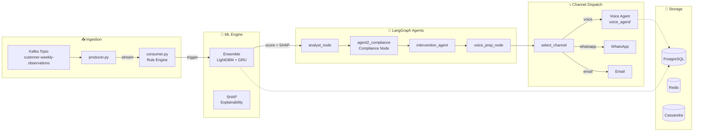
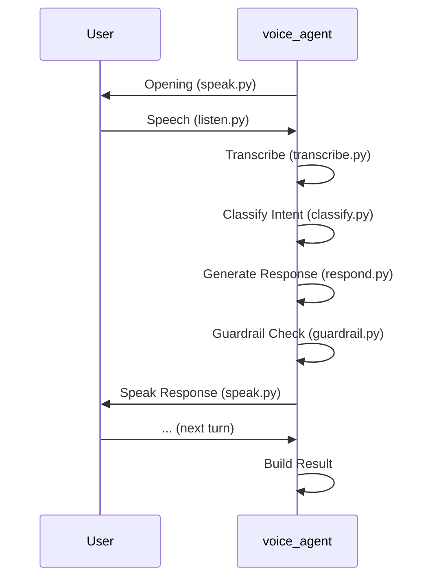
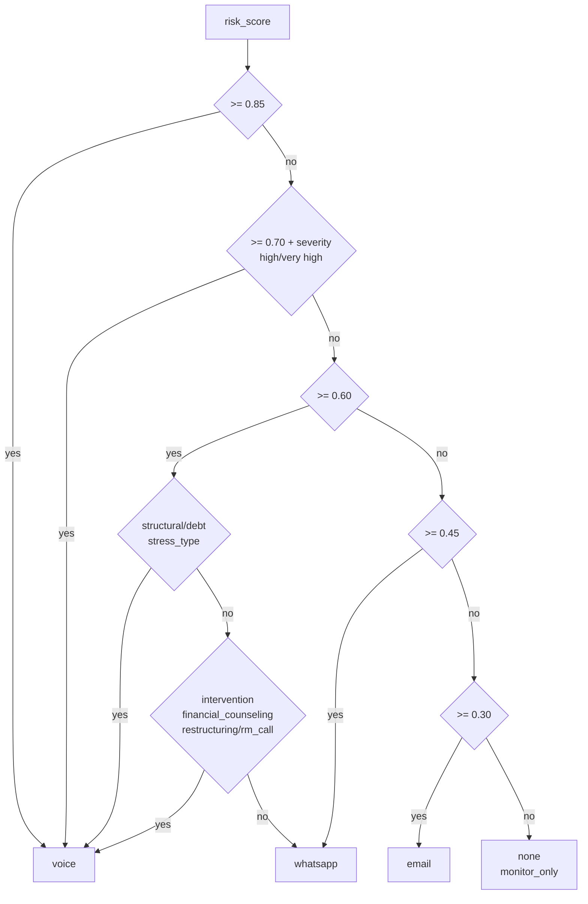
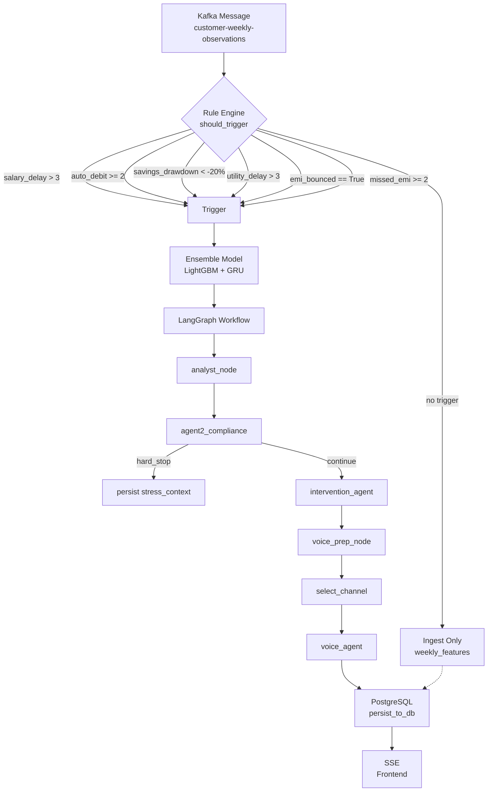
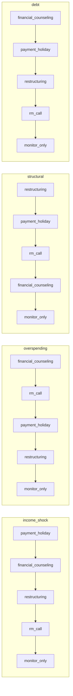
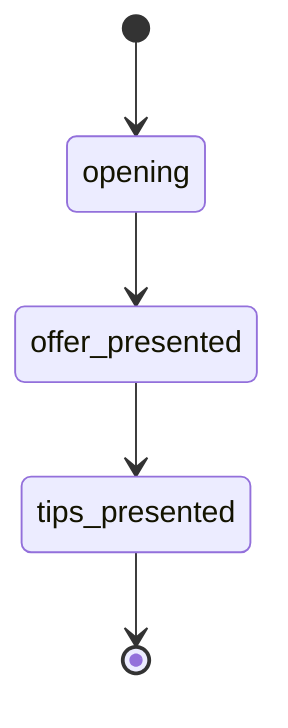

# Pre-Delinquency Intervention Engine

A multi-agent pre-delinquency detection and intervention system. Predicts customer payment stress using ensemble ML (LightGBM + GRU), analyzes via LangGraph agent orchestration, and executes proactive outreach through real-time voice calls.

---

## Architecture Overview



---

## Key Features

### Ensemble ML
- LightGBM (tabular features) + GRU (temporal features) ensemble
- Weighted formula: `0.6 * lgb + 0.4 * gru`
- SHAP-based feature attribution (top 4 factors)
- Risk levels: HIGH (>= 0.75), MEDIUM (>= 0.50), LOW (< 0.50)
- Fallback weighted formula when models unavailable

### Multi-Agent Orchestration (LangGraph)
- **analyst_node**: Generates stress narrative, identifies stress_type and severity via LLM
- **agent2_compliance**: Hard-stop checks (fraud_flag, legal_npa_flag, existing_restructuring, kyc_lapsed)
- **intervention_agent**: Selects intervention method, generates outreach message and tone
- **voice_prep_node**: Builds voice_payload for voice agent

### Voice Agent (voice_agent/)



Components:
- agent.py - run_call() orchestration
- strategy.py - call strategy builder
- speak.py - Text-to-Speech
- listen.py - Audio capture
- transcribe.py - Speech-to-Text
- classify.py - Intent classification
- guardrail.py - Output sanitization
- utils.py - Logging, trajectory

### Channel Routing (select_channel in graph/nodes.py)



### Approval Queue
- Pending interventions queued for manager approval
- Voice calls execute after approval via SSE stream
- Status: PENDING -> APPROVED -> EXECUTED

---

## Tech Stack

| Layer | Technology |
|-------|------------|
| Orchestration | LangGraph |
| ML | LightGBM, GRU |
| LLM | LangChain + Groq (Llama 3.1) |
| API | FastAPI |
| Streaming | Kafka, Redis, SSE |
| Database | PostgreSQL, Redis, Cassandra |
| Frontend | React + TypeScript + Vite |
| Voice | gTTS, SpeechRecognition |

---

## Setup

```bash
# Install dependencies
pip install -r requirements.txt

# Start infrastructure
docker-compose up -d

# Set environment variables in .env
# GROQ_API_KEY, CEREBRAS_API_KEY, POSTGRES_*, REDIS_*, KAFKA_BROKER
```

## Run

```bash
# Run prediction pipeline
python app/main.py

# Start API
uvicorn app.api:app --host 0.0.0.0 --port 8000

# Frontend (optional)
cd frontend && npm install && npm run dev
```

---

## Project Structure

```
HoH/
├── app/
│   ├── api.py              # FastAPI endpoints
│   ├── executor.py         # Pipeline executor
│   ├── llm.py             # LLM configuration
│   ├── main.py            # predict() entry point
│   └── ml_engine.py       # LightGBM + GRU scoring
├── graph/
│   ├── __init__.py        # build_graph() - LangGraph workflow
│   ├── nodes.py           # analyst_node, agent2_compliance, intervention_agent, ...
│   ├── state.py           # Main_context TypedDict
│   └── channel_dispatch.py # Channel routing
├── voice_agent/
│   ├── agent.py          # run_call() - Voice orchestration
│   ├── strategy.py       # Call strategy builder
│   ├── speak.py          # Text-to-Speech
│   ├── listen.py         # Audio capture
│   ├── transcribe.py     # Speech-to-Text
│   ├── classify.py       # Intent classification
│   ├── guardrail.py      # Output sanitization
│   └── utils.py         # Logging, trajectory
├── pipeline/
│   ├── producer.py       # Kafka producer
│   ├── consumer.py      # Kafka consumer + Rule Engine
│   └── postgre_schema.sql
├── db/
│   ├── postgres.py      # PostgreSQL connection
│   ├── redis_client.py # Redis client
│   ├── cassandra_component.py
│   └── queries.py     # Database queries
└── frontend/
    └── src/
        ├── pages/    # Dashboard pages
        └── hooks/   # useVoiceStream (SSE)
```

---

## Data Flow



---

## LangGraph State

```python
class Main_context(TypedDict):
    prediction_id: int
    observation_week: str
    total_risk_score: float
    risk_level: str
    Shap: List[shap]
    Customer_profile: customer_profile
    Stress_context: stress_context
    eligible_interventions: List[str]
    hard_stop: bool
    hard_stop_reason: Optional[str]
    Message_Tone: str
    Message_content: str
    Intervention_method: str
    Intervention_justification: str
    selected_channel: Optional[str]
    channel_dispatch_result: Optional[dict]
    voice_payload: Optional[dict]
    voice_result: Optional[voice_result]
```

---

## API Endpoints

| Endpoint | Method | Description |
|----------|--------|-------------|
| `/health` | GET | Health check |
| `/dashboard/stats` | GET | Aggregated KPIs |
| `/customers` | GET | All customers with risk |
| `/customers/{id}` | GET | Customer profile |
| `/score/{id}` | GET | ML score + SHAP factors |
| `/pending-approvals` | GET | Pending interventions |
| `/pending-approvals/{id}/approve` | POST | Approve intervention |
| `/pending-approvals/{id}/reject` | POST | Reject intervention |
| `/voice/execute/{id}` | GET | SSE voice call stream |
| `/stream` | GET | SSE live data stream |

---

## Trigger Thresholds

| Rule | Threshold |
|------|-----------|
| salary_delay_days | > 3 |
| auto_debit_failures | >= 2 |
| savings_drawdown_pct | < -20% |
| utility_payment_delay_days | > 3 |
| emi_bounced_flag | == True |
| missed_emi_count_rolling | >= 2 |

---

## Hard Stop Conditions

| Flag | Description |
|------|-------------|
| fraud_flag | Confirmed fraud case |
| legal_npa_flag | Legal NPA classification |
| existing_restructuring | Already in restructuring |
| kyc_lapsed | KYC documents expired |

---

## Intervention Rankings by Stress Type



---

## Voice Call Stages



## Voice Outcomes

| Outcome | Escalate | Description |
|---------|----------|-------------|
| resolved | False | Customer satisfied |
| accepted_restructuring | True | Accepted restructuring |
| counsellor_requested | True | Requested advisor |
| escalated | True | Urgent issue |
| no_call_needed | False | Monitor only |

---

## Database Tables

- customers
- weekly_features
- model_predictions
- shap_explanations
- stress_context
- interventions
- voice_sessions
- pending_interventions
- model_training_runs
